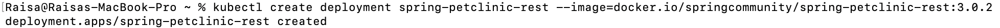
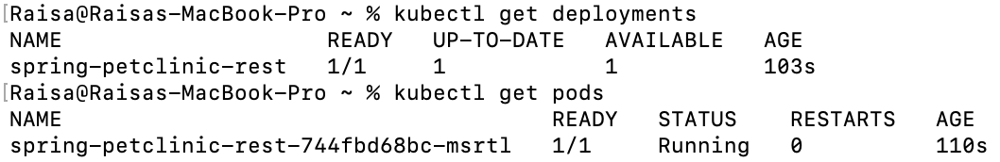
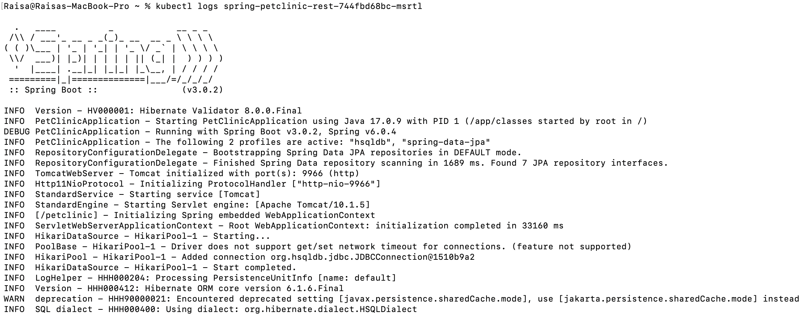
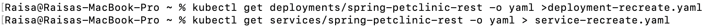
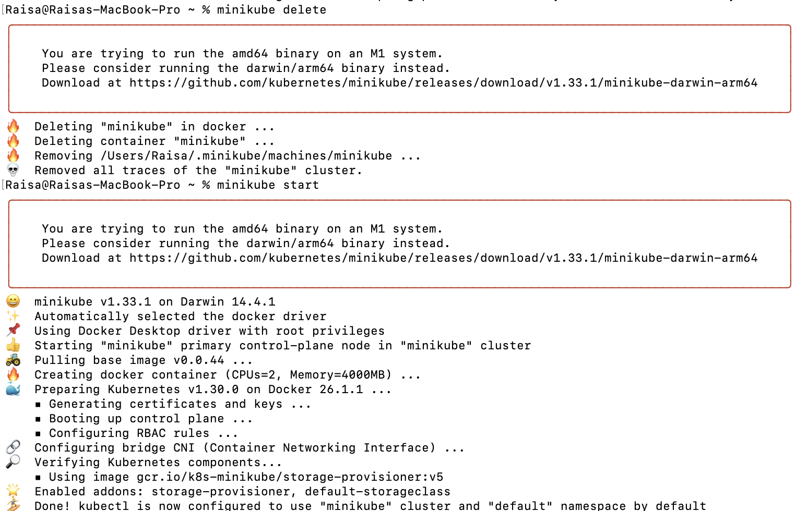
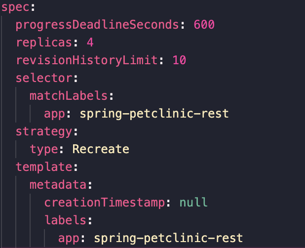
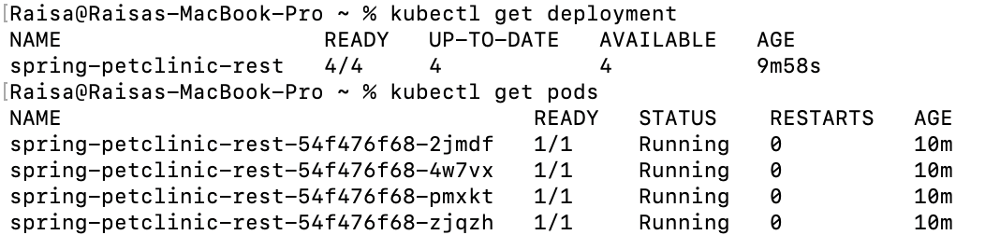

# Tutorial 11

## Reflection on Hello Minikube

1. Compare the application logs before and after you exposed it as a Service. What do you see in the logs? Does the number of logs increase each time you open the app?
   
**Before Exposure**

**After Exposure**

After the application was exposed as a service, the logs not only include the initial startup sequence but also record multiple GET / requests. Each of these entries represents a new interaction or request received by the server. Consequently, the logs show an increased number of entries, indicating that the application is actively handling incoming HTTP requests.

2. Notice that there are two versions of `kubectl get` invocation during this tutorial section. The first does not have any option, while the latter has `-n` option with value set to `kube-system`. What is the purpose of the `-n` option and why did the output not list the pods/services that you explicitly created?

The `-n` option in the `kubectl get` command serves to specify a namespace for filtering resources within a Kubernetes cluster. For instance, when running `kubectl get services` without the `-n` option, it defaults to the default namespace, displaying resources such as `hello-node`, as seen in tutorials. Conversely, utilizing `kubectl get pods,services -n kube-system` directs the command to the kube-system namespace, which hosts critical system processes. Consequently, any pods and services created, likely in the default namespace, would not be visible in the output of the latter command.

## Reflection on Rolling Update & Kubernetes Manifest File

1. What is the difference between Rolling Update and Recreate deployment strategy?

In Kubernetes, the Rolling Update and Recreate strategies represent two different approaches to deploying updates. Rolling Update updates Pods gradually, minimizing downtime and ensuring service availability during the process. It's ideal for critical production environments. On the other hand, recreate involves taking down all existing Pods before creating new ones, resulting in downtime. This simpler approach is suitable for applications where brief downtime is acceptable and a fresh start is preferred.

2. Try deploying the Spring Petclinic REST using Recreate deployment strategy and document your attempt

- Create Deployment

- Create the yaml files

- Delete and Restart Minikube

- Modify Deployment Strategy to `Recreate`

- Test the Recreate deployment 

3. Prepare different manifest files for executing Recreate deployment strategy.
`deployment-recreate.yaml` and `service-recreate.yaml`

4. What do you think are the benefits of using Kubernetes manifest files? Recall your experience in deploying the app manually and compare it to your experience when deploying the same app by applying the manifest files (i.e., invoking `kubectl apply -f` command) to the cluster.

Using Kubernetes manifest files offers several practical benefits, simplifying application management. These files allow me to specify my application's requirements in a format that Kubernetes understands and manages automatically. Once defined, Kubernetes takes care of the heavy lifting to ensure smooth operation. Additionally, I can easily track changes to these setup files, similar to how I manage code changes, enabling me to troubleshoot issues, revert changes if needed, and monitor changes over time. Moreover, applying these files using `kubectl apply -f` is more efficient and less error-prone compared to manually typing commands for each part of my application setup.